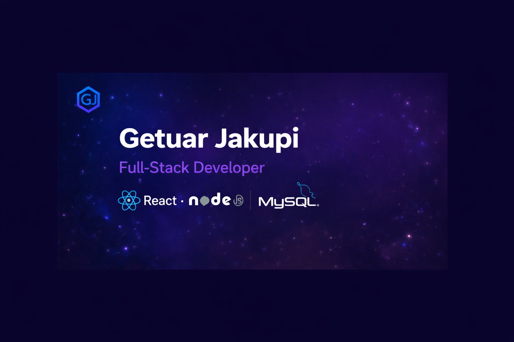

# Getuar Jakupi – Personal Portfolio

Modern personal portfolio website built with **React** and **Tailwind CSS** showcasing my full-stack projects, technical skills, and experience.

## 🌐 Live Demo
👉 https://your-domain.com  
(or Vercel / Netlify link)

---

## 🧑‍💻 About Me

Computer Science & Engineering student passionate about full-stack development.  
Focused on building scalable web applications using modern technologies.

---

## 🛠 Tech Stack

### Frontend
- React
- Tailwind CSS
- JavaScript (ES6+)
- Responsive Design

### Backend (Projects)
- Node.js
- Express.js
- JWT Authentication
- Role-Based Access Control (RBAC)

### Databases
- MySQL
- MongoDB

### Tools & Other
- Git & GitHub
- Docker
- ImageKit
- Postman

---

## 📂 Features

- Modern responsive UI
- Clean minimal design
- Projects showcase
- Skills section
- Contact form
- GitHub integration
- SEO optimized

---

## 📸 Preview



---

## 📦 Installation

Clone the repository:

```bash
git clone https://github.com/getuar04/portofolio.git
cd portofolio